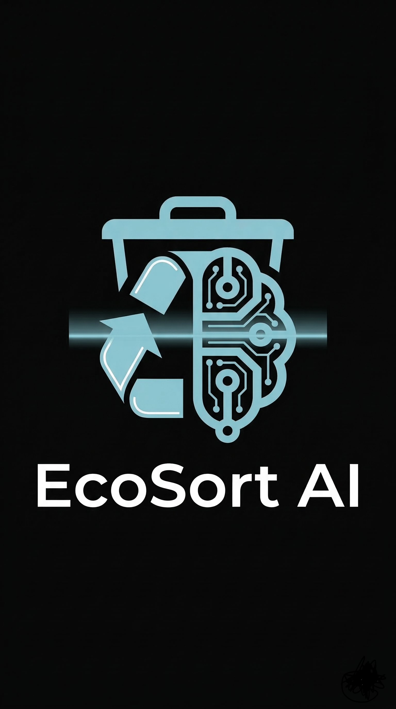

# ♻️ EcoSort AI: Intelligent Plastic Segregation

EcoSort AI is a deep learning-powered web application designed to automate the identification and categorization of plastic waste. Using a custom-trained **YOLO (You Only Look Once)** model, the system identifies resin identification codes (PET, HDPE, etc.) in real-time to streamline the recycling process.



## 🚀 Key Features
* **High-Accuracy Detection:** Custom model trained for **4.7 hours** on a specialized dataset, achieving a **98% Mean Average Precision (mAP)**.
* **Dual-Mode Inference:** * **Static Upload:** Upload images for instant analysis.
    * **Live Webcam Feed:** Real-time object detection using OpenCV and Flask.
* **Color-Corrected Processing:** Integrated BGR-to-RGB conversion for local inference consistency.

## 🧠 The Model
The "brain" of EcoSort AI is a YOLOv8-based model trained on hundreds of annotated images of plastic waste.
* **Training Time:** 4.7 Hours
* **Input Resolution:** 640x640px
* **Performance:** 98% Accuracy across common resin categories.

## 🛠️ Tech Stack
* **AI/ML:** Python, Ultralytics YOLO, PyTorch
* **Backend:** Flask (Python)
* **Frontend:** HTML5, CSS3 (Modern Dark Theme), JavaScript
* **Computer Vision:** OpenCV
* **Version Control:** Git & GitHub

## 📂 Project Structure
```text
Plastic_Project/
├── models/
│   └── best.pt        <-- The Trained Weights
├── static/
│   ├── uploads/       <-- Processed images
│   └── logo.png       <-- Branding
├── templates/
│   └── index.html     <-- Web Interface
└── app.py             <-- Flask Backend Logic
